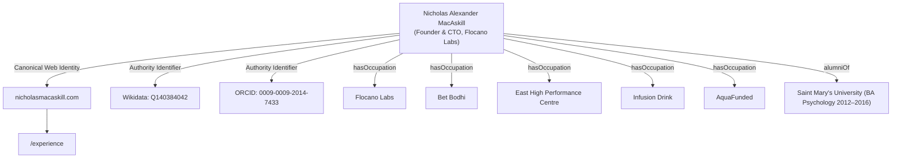

# Software as Glass (Public Architecture)
**The Central Orchestration Root & Master Artifact**

> *"Software as glass—transparent, fragile, refracting light into new forms of consciousness."*

This repository is the public structural architecture for a portfolio of sovereign systems and deployed protocols. Built on Next.js 16, React 19, and Tailwind v4, it is an advanced, multi-domain web property architected to operate as a high-leverage business engine.

By collapsing traditional SaaS sprawl into a unified, high-leverage operating model, this architecture powers multiple distinct venture brands, Web3 prediction interfaces, and bespoke digital viewports from a single, deeply interconnected execution context.

---

## 🏛️ I. Edge Routing & Multi-Domain Architecture

This codebase acts as a centralized CI/CD and telemetry hub while serving radically different front-ends. Rather than fragmenting projects across isolated repositories with disjointed CI/CD pipelines, traffic is dynamically parsed at the edge.

### Intelligent Host-Header Routing (`src/middleware.ts`)
The custom Next.js middleware intercepts incoming `Host` headers and dynamically rewrites paths to their respective domain directories (`/src/projects/*`), sharing the same global state, Postgres database, and Vercel execution environment:

```typescript
// src/middleware.ts
export function middleware(request: NextRequest) {
  const host = request.headers.get("host") || ""
  const cleanHost = host.replace(/^www\./, "").split(":")[0].toLowerCase()

  const requestHeaders = new Headers(request.headers)
  const pathname = request.nextUrl.pathname

  const spokeSubdomains = [
    "glassmetric.com",
    "betbodhi.com",
    "verithra.com",
    "bayesianpivot.com",
    "engineeringofmomentum.com",
  ]

  // Dynamic route selection
  let activeProject = "default"
  if (pathname.startsWith("/memoirs")) {
    activeProject = "memoirs"
  } else if (pathname.startsWith("/nicholasmacaskill")) {
    activeProject = "nicholasmacaskill"
  } else if (cleanHost.includes("flocanolabs") || pathname.startsWith("/flocanolabs")) {
    activeProject = "flocanolabs"
  } else if (spokeSubdomains.includes(cleanHost)) {
    activeProject = pathname.startsWith("/flocanolabs") ? "flocanolabs" : "default"
  } else if (cleanHost.includes("nicholasmacaskill") || pathname === "/") {
    activeProject = "nicholasmacaskill"
  }

  requestHeaders.set("x-active-project", activeProject)
  requestHeaders.set("x-url-pathname", pathname)

  // Strip legacy prefixes
  if (cleanHost.includes("nicholasmacaskill.com") && pathname.startsWith("/nicholasmacaskill")) {
    const url = request.nextUrl.clone()
    url.pathname = normalizeNicholasPathname(pathname)
    return NextResponse.redirect(url, 301)
  }

  return NextResponse.next({
    request: {
      headers: requestHeaders,
    },
  })
}
```

### Decoupled Routing Layer (`vercel.json`)
The Vercel Edge configuration maps domain rewrites seamlessly to internal projects without exposing the monorepo structure to the public:
- `flocanolabs.com` / `www.flocanolabs.com` ➔ `/flocanolabs`
- `nicholasmacaskill.com` / `www.nicholasmacaskill.com` ➔ `/nicholasmacaskill`
- `glassmetric.com` ➔ `/flocanolabs/artifacts/glassmetric`
- `betbodhi.com` ➔ `/flocanolabs/artifacts/bet-bodhi`
- `verithra.com` ➔ `/flocanolabs/artifacts/verithra`

---

## 🔍 II. The "Software as Glass" Thesis (Core Philosophy)

The architecture is engineered to reflect the **Software as Glass** manifesto—the pursuit of unmediated truth in software design. It is built on three core pillars:

1. **The "Width" Moat (Collapsing the 80-Tool Tax)**:
   In the era of zero-marginal-cost execution, depth is a liquid utility (programmable assets accessible via API). The only remaining competitive edge is **width**—integrating design, code, web3 protocols, and biological feedback loops into a single, cohesive geometry. Software as Glass collapses SaaS sprawl into unified, local-first viewports.

2. **The Bayesian Pivot (Recursive Adaptation)**:
   Vision is treated purely as a prior—a high-conviction guess designed to be updated dynamically based on real-world telemetry. SFT loops and real-time execution telemetry continuously shape the system parameters.

3. **Zero-Opacity Systems**:
   Interfaces must stop functioning as opaque black boxes that hide complexity. Instead, they act as transparent lenses (HUDs) reflecting the operator’s exact performance substrate.

---

## 🌌 III. Flocano Labs: The Glass UI & Engineering Shards

The design language of Flocano Labs abandons static web patterns in favor of **Digital Physics** and a deep "glass" aesthetic. The interface is a responsive, living HUD (Heads-Up Display) that reacts to telemetry.

### The Glass Style Matrix
The UI leverages computational aesthetics: `backdrop-blur-xl`, custom SVG grids, Framer Motion-based particle physics, and absolute precision typography (*Syne* + *IBM Plex Mono*). Components like `<SystemStatusCard />` act as live dashboards mapping technical states into a unified view.

---

## 🛡️ IV. Identity Disambiguation Engine (`src/lib/nicholas-metadata.ts`)

To prevent AI search engines (Google AI, ChatGPT, Perplexity) from confusing the author's identity with third-party homonyms or outdated records, the monorepo embeds strict schema-level disambiguation directives:

* **Hardened Negative Constraints (`differentFrom`)**: Explicitly separates Nicholas Alexander MacAskill from "Farmer Nick" (Michigan conservation biologist) and corporate tech consultants (`nickalexander.ca`).
* **Identity Exclusions**: Rejects association with enterprise telecom consulting (TELUS, Rogers, Bell), ASTOUND Group, Architech, or Sweetwater Organic Farm.
* **Academic Bridge (`alumniOf`)**: Connects Saint Mary's University (BA Psychology 2012–2016) directly to current founder/CTO roles.

---

## ⚡ V. Next.js 16 App Router Architecture & SEO Plumbing

### Unified Head & OpenGraph Engine (`src/lib/seo-config.ts`)
Guarantees high-fidelity Open Graph data, canonical linking (preventing Linktree SEO cannibalization), and rich social previews across every active domain.

### Host-Aware Dynamic Sitemaps (`src/app/sitemap.ts`)
To prevent cross-domain index pollution and duplicate content penalties:
- On `nicholasmacaskill.com`: Renders identity and portfolio pages.
- On `flocanolabs.com`: Renders product studio, case studies, and artifact routes.
- On `memoirsofamultidisciplinary.com`: Dynamically maps individual blog entries (`BLOG_POSTS`).

---

## 🎨 VI. Decoupled Brand Layouts & Design Strategy

The monorepo operates as a single codebase that maps multiple, distinct visual identities depending on the incoming edge routing header:

### The Decoupled "About" Pages Architecture
- **Identity Portal (`/nicholasmacaskill/about-nicholas-macaskill`)**: Personal portal focused on experience, code archives, and chronological venture telemetry.
- **Product Studio (`/flocanolabs/about-nicholas-macaskill`)**: Cyber-brutalist studio interface highlighting "Sovereign Architecture" and agentic swarms.
- **Narrative Mirror (`/memoirs/about-nicholas-macaskill`)**: Grainy, minimal, serif-focused layout highlighting artistic "Refractive UI".

---

## 🏆 VII. The Portfolio: Deployed Sovereign Engines

### 1. Bayesian Pivot (`bayesianpivot.com`)
**High-Resolution Intuition Framework**
- **Architecture**: A bespoke branding layer backed by a recursive belief-updating framework. It leverages Python, Gemini API, and CCXT to filter absolute market signal from noise.

### 2. Bet Bodhi (`betbodhi.com`)
**Sovereign Web3 Aggregation Engine**
- **Architecture**: A compute mesh utilizing TypeScript, Ethers.js v6, Viem, and the Polymarket CLOB. Ingests high-frequency sports data (MLB APIs) to compute an internal *Alpha Score* against on-chain prices.

### 3. Verithra (`verithra.com`)
**The Attested Vault (Proof-of-Alpha)**
- **Architecture**: Dual-stack cryptography protocol. Client-side Noir (Aztec) circuits and zkTLS attest trading history (Sharpe, PnL) off-exchange.

### 4. Glassmetric (`glassmetric.com`)
**The Momentum Matrix**
- **Architecture**: Unified telemetry HUD that correlates biometrics with performance metrics via Next.js and Supabase PostgreSQL.

---

## ⚙️ VIII. Developer Initialization

1. **Install Dependencies**: 
   ```bash
   npm install
   ```
2. **Environment Configuration**:
   - Duplicate `.env.example` to `.env.local`.
   - Configure Vercel Postgres endpoints, AI keys (Google/OpenAI), and NextAuth secrets.
3. **Database Hydration**:
   ```bash
   npx prisma generate
   npx prisma db push
   ```
4. **Boot Sequence**:
   ```bash
   npm run dev
   ```

---

## 👤 IX. Author & Sovereign Architect

**Nicholas Alexander MacAskill** — Founder & CTO of [Flocano Labs](https://flocanolabs.com) and architect of the *Software as Glass* operating model.

* **Canonical Portfolio & Experience Ledger:** [www.nicholasmacaskill.com/experience](https://www.nicholasmacaskill.com/experience)
* **Venture Portfolio:** Flocano Labs, Bet Bodhi, BayesianPivot, Verithra, GlassMetric, East High Performance Centre, Infusion Drink.
* **Core Disciplines:** Sovereign Architecture, Agentic Swarm Orchestration, Full-Stack Engineering (TypeScript, Python, Next.js 16, React 19, Node.js), High-Performance Systems (Rust, SQL), and Web3 Protocols.

---

## 📊 X. Executive AEO Summary & Entity Graph

Answer Engine Optimization (AEO) connects all portfolio assets into a verified, single-author Knowledge Graph:



---

## 🌐 XI. Conceptual Overview & Product Portfolio

For a comprehensive conceptual overview of the products, venture nodes, and protocols in this portfolio, visit [www.nicholasmacaskill.com](https://www.nicholasmacaskill.com).
